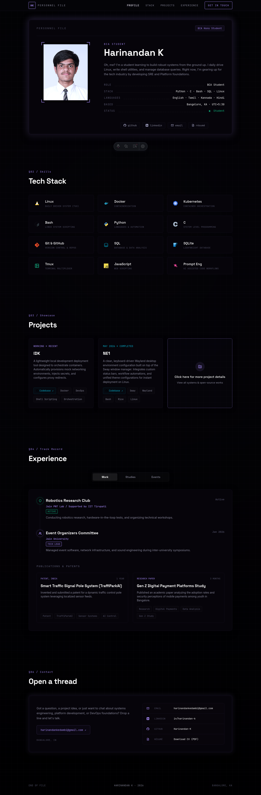

# Hari's Ping Portfolio

A modern, systems-engineering themed personal portfolio built with [Astro](https://astro.build/). Designed to showcase open-source projects, system utilities, and infrastructure foundations with a clean, terminal-inspired glassmorphic aesthetic.

## Preview



## Development Approach

As my primary engineering focus lies in backend systems, Linux infrastructure, and Site Reliability Engineering (SRE), the frontend codebase of this portfolio was developed utilizing AI-assisted generation workflows. This approach allowed me to rapidly deploy a robust, modern presentation layer while keeping my technical focus strictly on systems-level architecture, local development tools, and deployment pipelines.

## Tech Stack

* **Framework:** Astro

* **Styling:** Custom CSS (CSS Variables, Flexbox/Grid, Glassmorphism)

* **Interactivity:** Vanilla JavaScript

* **Deployment:** CI/CD Pipeline (Coming Soon)

## Running Locally

If you want to clone this repository and run it on your own machine, follow these steps:

**1. Clone the repository:**

```bash
git clone [https://github.com/YOUR-USERNAME/ping-portfolio.git](https://github.com/YOUR-USERNAME/ping-portfolio.git)
cd ping-portfolio

```

**2. Install dependencies:**

```bash
npm install

```

**3. Start the local development server:**

```bash
npm run dev

```

The site will now be running at `http://localhost:4321`.

## Project Structure

```text
/
├── public/           # Static assets (images, icons, resumes)
├── src/
│   ├── data/         # JSON data files for projects and skills
│   ├── layouts/      # Base HTML shell components
│   ├── pages/        # Astro routing (index, projects)
│   ├── scripts/      # Vanilla JS for DOM manipulation
│   └── styles/       # Global CSS stylesheets
└── package.json

```

## **Design Attribution & Acknowledgement**

**It must be formally acknowledged that the user interface, visual design, and layout architecture of this portfolio are a direct adaptation of the exceptional work by [Damian Briones](https://www.google.com/search?q=https://damian-briones-portfolio.vercel.app/). I extend my sincerest gratitude to him for his original design, which served as the exact blueprint and inspiration for this project's frontend presentation.**
